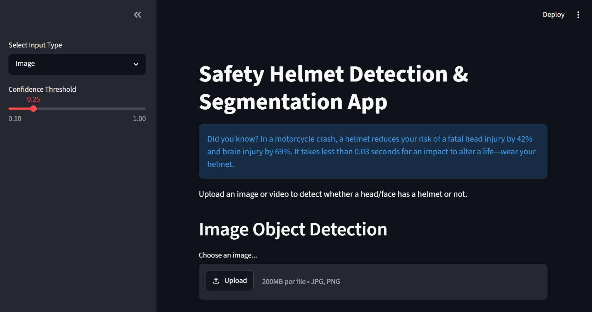

**Computer Vision** is a field of artificial intelligence that enables machines to interpret and understand visual data such as images and videos. It focuses on tasks like object detection, image classification, and segmentation, allowing systems to make decisions based on visual information.  

**YOLO** (You Only Look Once) is a real-time object detection algorithm that detects and localizes objects in a single forward pass of a neural network. Unlike traditional methods that process regions separately, YOLO treats detection as a single regression problem, making it fast and efficient for real-time use.  

**Ultralytics** is a company that develops open-source computer vision tools, most notably the YOLO family of models. Their framework provides easy-to-use APIs for training, validating, and deploying vision models for real-world applications.  

**YOLO models** are available in different sizes (such as nano, small, medium, and large) to balance speed and accuracy. Smaller models are faster and suitable for edge devices, while larger models provide higher accuracy at the cost of computation. These models can be fine-tuned using transfer learning to solve custom vision tasks with limited data.  

**Task 1** - object detection and segmentation using pretrained YOLOv8n model through the Ultralytics framework to understand model inference, output formats, and visualization of detected objects.  
**Task 2** - performed object detection and segmentation on multiple images containing several objects and analyzed model performance using metrics such as precision, recall, F1-score, confidence distribution, and confusion matrices.  
**Task 3** - implemented an end-to-end video processing pipeline by extracting frames from a video, applying object detection and segmentation on each frame, and reconstructing the processed frames into an output video.  
**Project** - designed and implemented a real-world computer vision application to detect helmet compliance. A custom dataset was curated and manually annotated using Label Studio, followed by transfer learning on a pretrained YOLO11s model. The finetuned model weights were saved and used during inference. The trained model was evaluated using standard detection metrics. A website was made using Streamlit that can be used to upload images and videos and run it on the finetuned model to detect and segment a face/head with or without a helmet.  

